<!--
  ============================================================
  SEO & GEO METADATA
  Name: Bhargav Patel
  Current Role: AI Forward Deployed Engineer at Google Cloud India
  Previous: Fractal Analytics, Detect Technologies, Truminds Software Systems
  Alma Mater: Ahmedabad University (B.Tech in ICT, 2021)
  Location: Bengaluru, Karnataka, India | Ahmedabad, Gujarat, India
  Core Competencies: Agentic AI, Multi-Agent Systems, Model Context Protocol (MCP),
  LLM Orchestration, RAG Workflows, Vertex AI, GKE, LangSmith, Langfuse,
  OpenTelemetry, LangWatch, Computer Vision, Video Analytics, MLOps, PyTorch,
  TensorFlow, TensorRT, ONNX, TFX, Apache Airflow, Apache Kafka, BigQuery, Docker, Kubernetes.
  Research: 3 International Peer-Reviewed Publications (Image Compression, Fraud Detection, Signal Estimation)
  Speaking: 100+ Keynotes and Talks on AI/ML/MLOps across India
  ============================================================
-->

<div align="center">
  <h1 align="center">Hey there, I'm <a href="https://linkedin.com/in/bhargav-p-patel" target="_blank">Bhargav Patel</a> 👋</h1>

  <!-- Dynamic Animated Typing Header -->
  <a href="https://cloud.google.com/">
    
  </a>

  <p align="center">
    <strong>Engineering at the intersection of applied artificial intelligence and mission-critical enterprise delivery.</strong><br>
    <em>Specializing in Agentic AI systems, LLM orchestration, and taking systems from prototype to production-grade reliability.</em>
  </p>

  <!-- Top Socials & Professional Badges -->
  <p align="center">
    <a href="https://linkedin.com/in/bhargav-p-patel" target="_blank">
      
    </a>
    &nbsp;
    <a href="https://twitter.com/Bhargav_P28" target="_blank">
      
    </a>
    &nbsp;
    <a href="https://medium.com/@callbhargavp" target="_blank">
      
    </a>
    &nbsp;
    <a href="https://cloud.google.com/" target="_blank">
      
    </a>
    &nbsp;
    <a href="https://github.com/Engineer1999/Engineer1999/blob/main/Resume/Bhargav_Patel_Software_Engineer_Resume.pdf" target="_blank">
      
    </a>
    &nbsp;
    <a href="mailto:callbhargavp@gmail.com">
      
    </a>
  </p>

  <!-- Profile Visitor Counter -->
  <p align="center">
    
  </p>

  <!-- Preserved Profile GIF -->
  
</div>

---

## ⚡ Executive Overview

```yaml
engineer: Bhargav Patel
current_role: AI Forward Deployed Engineer
organization: Google Cloud India 🇮🇳
focus_areas:
  - Agentic AI Systems & Multi-Agent Orchestration
  - Production RAG Lifecycles (Retrieval, Routing, Tool Use & Reliability)
  - Rigorous LLM Evaluation & Observability (LangSmith, Langfuse, OpenTelemetry)
  - High-Throughput MLOps & Distributed Cloud Infrastructure (GKE, Vertex AI)
track_record:
  - 3 International Peer-Reviewed ML Publications
  - 100+ Speaking Engagements across India
  - Mentored 500+ Engineers & Student Builders
motto: "Accuracy, latency, and safety must be engineered and measured — never assumed."
```

> I work at the intersection of artificial intelligence and enterprise delivery. As an **AI Forward Deployed Engineer at Google**, my focus is **agentic AI systems and LLM orchestration**, and the engineering discipline of taking these systems from an experimental prototype into something an enterprise business can depend on in production with complete confidence.

---

## Career Milestones & Engineering Impact

<table>
  <tr>
    <td width="25%" valign="top">
      <strong>Google Cloud</strong><br>
      <em>AI Forward Deployed Engineer</em><br>
    </td>
    <td width="75%">
      Deploying production-grade <strong>Agentic AI architectures</strong> and foundation model solutions for enterprise clients. Architecting autonomous reasoning loops, model context interfaces, and multi-agent coordination frameworks backed by Google Cloud's enterprise infrastructure.
    </td>
  </tr>
  <tr>
    <td width="25%" valign="top">
      <strong>Fractal Analytics</strong><br>
      <em>AI Engineer</em><br>
      <code>GCP • Vertex AI • GKE</code>
    </td>
    <td width="75%">
      Built end-to-end <strong>Agentic RAG workflows</strong> and multi-agent systems on Google Cloud Platform covering the entire lifecycle: <em>retrieval, dynamic routing, tool use, scoring, and reliability</em>.
      <ul>
        <li>Engineered full observability and automated evaluation using <strong>LangSmith, OpenTelemetry, Langfuse, and LangWatch</strong> so accuracy, latency, and safety were continuously verified.</li>
        <li>Architected an <strong>agentic RFP evaluator with Model Context Protocol (MCP) server interfaces</strong>, deployed through Cloud Build CI/CD and rolled out in phases with client infrastructure teams.</li>
      </ul>
    </td>
  </tr>
  <tr>
    <td width="25%" valign="top">
      <strong>Detect Technologies</strong><br>
      <em>Junior Staff AI Engineer</em><br>
      <code>AWS • MLOps • Vision</code>
    </td>
    <td width="75%">
      Architected enterprise MLOps and deep learning pipelines on <strong>AWS and Kubernetes</strong>, with large-scale <strong>computer vision and real-time video analytics</strong> serving industrial safety and monitoring systems.
    </td>
  </tr>
  <tr>
    <td width="25%" valign="top">
      <strong>Truminds Software Systems</strong><br>
      <em>Machine Learning Engineer</em><br>
      <code>TFX • Airflow • TensorRT</code>
    </td>
    <td width="75%">
      Led machine learning initiatives spanning computer vision benchmarking and MLOps platform development. Built production pipelines using <strong>TensorFlow Extended (TFX), Apache Airflow, and PyTorch</strong>, optimizing edge inference with <strong>ONNX, TensorRT, and Apache Kafka</strong>.
    </td>
  </tr>
</table>

---

## Research Publications & Community Leadership

<div align="center">
  <table>
    <tr>
      <td width="50%" align="center">
        <h3>📑 3 International Publications</h3>
        <p>Documented peer-reviewed research in applied machine learning published in international venues:</p>
        <p align="left">
          🔹 <strong>Image Compression:</strong> Neural image compression and perceptual reconstruction.<br>
          🔹 <strong>Fraud Detection:</strong> Anomaly detection and financial fraud prevention using ML.<br>
          🔹 <strong>Signal Estimation:</strong> Statistical learning models for complex signal processing.
        </p>
      </td>
      <td width="50%" align="center">
        <h3>🎙️ 100+ Speaking Engagements</h3>
        <p>Keynotes, workshops, and technical talks delivered across premier institutions and tech summits in India:</p>
        <p align="left">
          🎤 Topics: <em>Agentic AI, LLM Evaluation, Production MLOps, Vertex AI, and Distributed Training</em>.<br>
          🌱 Active mentor to engineering teams, open-source contributors, and student developers nationwide.
        </p>
      </td>
    </tr>
  </table>
</div>

---

## 🛠️ Tech Stack

<div align="center">
  <p><em>From autonomous reasoning agents down to hardware accelerators & telemetry fabric.</em></p>

  <h3 align="center">🧠 Layer 1: Agentic Orchestration & Protocols</h3>
  <p align="center"><em>Autonomous decision-making, planning, tool-calling execution, and protocol interfaces.</em></p>
  <p align="center">
    
    
    
    
    
    
    
    
  </p>

  <h3 align="center">🔬 Layer 2: Core Machine Learning & Acceleration</h3>
  <p align="center"><em>Distributed training, fine-tuning, computer vision, video analytics, and hardware optimization.</em></p>
  <p align="center">
    
    
    
    
    
    
    
  </p>

  <h3 align="center">🛡️ Layer 3: Evaluation, Telemetry & Observability</h3>
  <p align="center"><em>Continuous evaluation, latency benchmarking, trace visualization, and production guardrails.</em></p>
  <p align="center">
    
    
    
    
    
  </p>

  <h3 align="center">🔍 Layer 4: Vector Memory & Semantic Search (RAG)</h3>
  <p align="center"><em>Long-term memory, embedding stores, hybrid search, and grounding engines.</em></p>
  <p align="center">
    
    
    
    
    
  </p>

  <h3 align="center">☁️ Layer 5: Cloud & Container Orchestration</h3>
  <p align="center"><em>Enterprise containerization, Kubernetes clusters, scalable compute, and deployment pipelines.</em></p>
  <p align="center">
    
    
    
    
    
    
    
  </p>

  <h3 align="center">📊 Layer 6: Enterprise Data Pipelines & Streaming</h3>
  <p align="center"><em>Massive-scale analytical query engines, distributed stream ingestion, and feature storage.</em></p>
  <p align="center">
    
    
    
    
    
    
  </p>

  <h3 align="center">🛠️ Layer 7: Infrastructure as Code & Continuous Delivery</h3>
  <p align="center"><em>Declarative infrastructure, reproducible pipelines, and configuration management.</em></p>
  <p align="center">
    
    
    
    
    
  </p>

  <h3 align="center">💻 Layer 8: Languages & Runtimes</h3>
  <p align="center"><em>High-performance backend systems, asynchronous runtimes, and algorithmic scripting.</em></p>
  <p align="center">
    
  </p>
</div>

---

## 📈 GitHub Stats

<div align="center">
  
  <br><br>
  <p align="center">
    
    &nbsp;&nbsp;
    
    &nbsp;&nbsp;
    
  </p>
</div>

